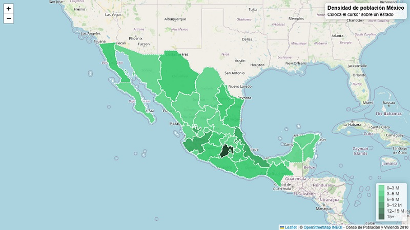

# Mapa interactivo con GeoJSON

Para este ejemplo se utiliza un archivo GeoJSON con información del censo de población y vivienda 2020 de los estados de México, [INEGI](https://www.inegi.org.mx/temas/estructura/#mapas).

El archivo GeoJSON contiene la siguiente información:

- **CVE_ENT**: Clave del estado
- **NOM_ENT**: Nombre del estado
- **POBLACION**: Población total
- **geometry**: Polígono del estado

El mapa muestra la población de cada estado de México, con un mapa base de OpenStreetMap y un mapa de calor de la población.

## Autores ✒️
- **Marco Robles** - *Desarrollo* - [mroblesdev](https://github.com/mroblesdev)

## Licencia 📄

Este proyecto está bajo la Licencia MIT License - mira el archivo [LICENSE](LICENSE) para más detalles.

## Expresiones de Gratitud 🎁

* Comenta a otros sobre este proyecto 📢
* Invita una cerveza 🍺 o un café ☕ [Da clic aquí](https://www.paypal.com/paypalme/markorobles?locale.x=es_XC.) 
* Da las gracias públicamente 🤓.